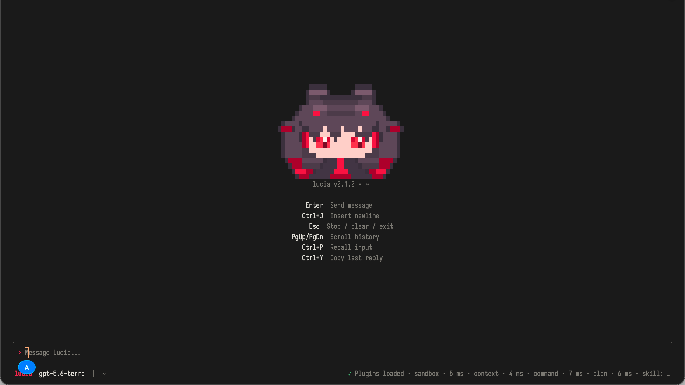

# Lucia

[English](README.md) | 简体中文

**一个可检查、可配置、可扩展的终端 Agent。**

Lucia 是一套完全开源的 Agent 运行时与终端界面，用于连接语言模型、工具、会话和 WASM 插件。它面向希望查看完整请求链路、按需启用能力，并能在不改动 Agent Core 的前提下替换具体功能的开发者。

[快速开始](#快速开始) · [编译与安装](#编译与安装) · [模型配置](#配置模型) · [文档](#文档入口) · [安全](#安全模型)

> [!NOTE]
> Lucia 仍处于早期开发阶段，接口和插件协议在稳定版本发布前可能继续调整。



## 为什么选择 Lucia

- **运行过程可以检查。** 模型请求、Agent 循环、工具路由、会话存储、插件加载和权限检查均采用 MIT 许可证开放源代码。
- **具体能力按需安装。** MCP、Skill、命令、上下文压缩、计划、审批和多 Agent 协作位于独立插件中，不会成为 Core 的强制组成部分。
- **权限边界明确。** 插件必须通过 manifest 声明能力，可信身份、owner 和资源上限由 Host 控制。
- **不局限于 TUI。** Lucia 既可以作为轻量 Agent Core 或插件版终端应用运行，也可以作为 Rust 库嵌入其他程序。

## 主要能力

- 在终端中与真实模型交互，并按项目保存和恢复会话。
- 接入 OpenAI、Anthropic 和 OpenAI-compatible 模型服务。
- 通过 WASM 插件增加 MCP、Skill、命令、上下文压缩、计划、审批和多 Agent 协作等能力。
- 只使用轻量的 Agent Core，或按需组合会话、Runtime、Plugin Host 和 TUI。
- 把 Lucia 作为 Rust 库嵌入自己的应用，而不是只能使用现成终端界面。

Lucia 当前提供 Context、MCP、Skill、Command、Teammate、Plan 和 Permission 等官方插件。插件不是附属脚本，而是项目的主要扩展方式：Core 负责通用 Agent 机制，具体功能留在各自插件中。

## 快速开始

只想确认项目能够工作，安装 Rust 后在仓库根目录执行：

```bash
cargo run -p agent-basic-cli -- --demo "你好"
```

这个示例使用确定性的内置模型，不需要 API key，也不会连接外部模型服务。它会走完一次模型请求、原生工具调用和结果回传流程。

## 环境要求

- Rust stable，具体工具链以仓库中的 `rust-toolchain.toml` 为准。
- `wasm32-wasip2`，仅在编译 WASM 插件时需要。
- Bun 是可选项，用于批量构建和打包官方插件，不是编译 Lucia Core 的必要条件。

缺少 WASM target 时可以手动安装：

```bash
rustup target add wasm32-wasip2
```

## 编译与安装

Lucia 有纯 Core 和插件版两种构建形态。两者生成的命令都叫 `lucia`，区别在于是否包含 Plugin Host、Wasmtime、插件管理和插件 UI。

### 方式一：只使用 Cargo 编译纯 Core

纯 Core 版本不包含 WASM 插件系统，适合只需要模型、原生工具、会话和事件能力的用户。

```bash
cargo build \
  -p lucia \
  --release \
  --no-default-features \
  --target-dir target/core-tui

./target/core-tui/release/lucia --demo
```

安装到 Cargo bin 目录：

```bash
cargo install \
  --path crates/agent-tui \
  --locked \
  --force \
  --no-default-features

lucia --demo
```

如果 shell 找不到 `lucia`，确认 `$HOME/.cargo/bin` 已加入 `PATH`。

### 方式二：只使用 Cargo 编译插件版

插件版包含 Plugin Host 和插件管理能力，但单独编译主程序不会自动构建或安装官方插件。

```bash
cargo build \
  -p lucia \
  --release \
  --features plugins \
  --target-dir target/plugin-tui

./target/plugin-tui/release/lucia --demo
```

安装插件版命令：

```bash
cargo install \
  --path crates/agent-tui \
  --locked \
  --force \
  --features plugins
```

不使用 Bun 也可以手动编译并加载单个插件。下面以 Echo 插件为例：

```bash
cargo build \
  -p echo-plugin \
  --release \
  --target wasm32-wasip2 \
  --target-dir examples/plugins/echo-plugin/target

./target/plugin-tui/release/lucia \
  --demo \
  --plugin-manifest examples/plugins/echo-plugin/plugin.toml
```

### 方式三：安装插件版 TUI

需要插件加载能力时，可以安装 Bun 后运行：

```bash
bun run install:tui
lucia plugin install context
lucia --demo
```

`install:tui` 只通过 Cargo 编译并安装具备 Plugin Host 的 `lucia`，不会安装或启用任何功能插件。用户通过 `lucia plugin search` 和 `lucia plugin install <id>` 自行选择能力；官方插件与第三方插件遵循同一套安装、权限和生命周期协议。

只想构建而不安装时，可以分别运行：

```bash
bun run build:tui:core
bun run build:tui:plugins
bun run build:plugin:official
```

对应产物位于 `target/core-tui/release/lucia`、`target/plugin-tui/release/lucia` 和各插件目录的 `target/wasm32-wasip2/release`。

## 配置模型

首次启动会创建 `$HOME/.lucia/config.toml`。也可以先初始化配置后退出：

```bash
lucia --init
```

下面是一份最小配置：

```toml
[model]
name = "default"
provider = "open-ai"
base_url = "https://api.openai.com/v1"
model = "替换为账号可用的模型 ID"
api_key_env = "OPENAI_API_KEY"
openai_protocol = "responses"

[agent]
max_steps = 0
max_tokens = 4096
stream = true

[tui]
sessions_dir = "projects"
```

`api_key_env` 保存的是环境变量名，不是密钥本身。设置环境变量后启动：

```bash
export OPENAI_API_KEY="你的密钥"
lucia
```

`provider` 还支持 `open-ai-compatible` 和 `anthropic`。本地模型服务、其他接口地址及完整配置项见 [TUI 配置与会话](docs/guide/tui-configuration.md)。

## 安全模型

开源不等于自动安全，WASM 也不是一句“沙箱”就能解决所有问题。Lucia 选择把边界写清楚，而不是给出无法兑现的承诺。

- 插件必须在 manifest 中声明文件读取、原生进程或 Agent Runtime 等能力，未声明的能力不会被授权。
- Host 掌握插件身份、owner 和资源上限，不信任模型或插件自行声明的真实值。
- `process_exec` 等于授予插件当前系统用户的原生进程权限。启用这类插件前，仍应检查来源和代码。
- 连接在线模型时，请求会发送到你配置的模型服务；获权插件也可能访问本地资源。请根据自己的数据要求选择服务商、插件和权限。

Lucia 想提供的不是“请相信我们”，而是让信任有可以检查的依据。

## 面向开发者

如果只是增加一种具体能力，优先通过插件实现。Core 仅承载通用 Agent 机制；MCP、Skill、命令、上下文压缩、工作流、多 Agent 编排和特定 UI 等具体功能均由插件负责。

仓库的主要模块保持明确的职责边界：

- `agent-core`：模型网关、ReAct、上下文、事件和扩展契约。
- `agent-tool`：通用工具类型与原生工具注册表。
- `agent-session`：版本化会话记录、CAS 和存储。
- `agent-runtime`：Agent 身份、派生、生命周期、权限和资源限额。
- `agent-plugin-host`：WASM ABI、鉴权、贡献注册和 owner 路由。
- `agent-plugin`：Guest SDK、共享协议类型、WIT 绑定和导出宏。
- `agent-tui`：应用组装、配置、输入和终端渲染。

常用验证命令：

```bash
cargo test -p agent-core
cargo test -p lucia --no-default-features
cargo test -p lucia --features plugins
```

修改插件时还应编译 `wasm32-wasip2` 组件，并运行该插件的真实 Host 冒烟测试。各官方插件已经在 `package.json` 中提供对应的 `bun run test:plugin:*` 命令。

## 文档入口

- [快速开始](docs/guide/quick-start.md)
- [TUI 使用](docs/usage/tui.md)
- [CLI 使用](docs/usage/cli.md)
- [插件管理](docs/usage/plugin-management.md)
- [创建 WASM 插件](docs/plugin/quick-start.md)
- [插件开发手册](docs/development/plugin.md)
- [Manifest 与权限](docs/host/manifest-capabilities.md)
- [Rust API 手册](docs/reference/rust-api.md)
- [架构边界](docs/guide/architecture.md)

## 项目状态

当前仓库已经包含离线示例、纯 Core 和插件版 TUI、官方插件、端到端插件冒烟测试和分层开发文档。稳定版本发布前，Lucia 仍需要更广泛的真实环境验证、安全审查和不同工作流的反馈。

## 获取帮助与参与贡献

使用 GitHub Issues 提交可复现的问题、边界明确的功能建议和文档问题。提交代码时：

- 保持 Core 通用机制与具体插件行为之间的职责边界。
- 修改协议时，在边界两侧分别增加针对性测试。
- 提交 Pull Request 前运行 `cargo fmt --all -- --check` 以及涉及的 crate 或插件测试。
- 不要在 Issue 或提交中包含 API key、token、私有配置或未经脱敏的真实模型测试输出。

Lucia 希望成为一套任何人都能理解、修改并掌握边界的 Agent 基础设施。欢迎提交范围明确的修复、文档改进和独立插件。

## 许可证

[MIT](LICENSE)
